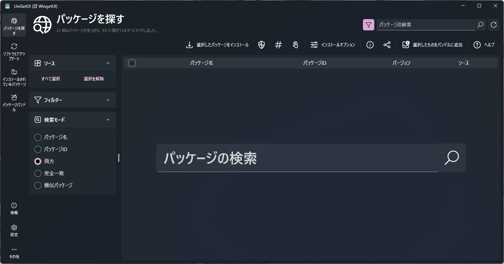

Windows11のパソコンにUnigetUI（旧：WingetUI）を入れてみたら便利だったのでサクッと紹介しておきます。

## UnigetUIって何？

UnigetUIとはWingetやnpmなどのパッケージマネージャーをGUIで操作できるようにするWindowsソフトウェアです。  
普通WingetやnpmはCLI、要するにコマンドプロンプトでコマンドを入力して使うため、ある程度知識がないと使うのがちょっと怖かったりします。

そこでUnigetUIの出番。UnigetUIはMicrosoft Storeからインストールできるので誰でも簡単に導入できます。  
一度導入してしまえばGUIで直感的にソフトウェアをインストールしていくことができます。

## 導入方法

<https://apps.microsoft.com/detail/xpfftq032ptphf>

上記リンクからMicrosoft Storeに飛ぶことができ、そこからインストールできます。

## 使い方

起動したらこのような画面が出てきます。

1. 検索ボックス（1の赤四角または画面中央）からソフトウェア名を入力して検索
2. 目的のソフトウェアの項目のところにチェックを入れる
3. 「選択したパッケージをインストール」をクリック
4. ダウンロードが開始されあとはそのままインストール

インストールに管理者権限が必要なソフトウェアに関してはユーザーアカウント制御が出てくるので許可しましょう。

**インストーラーの画面をすべてデフォルトで進めていった時の状態でインストールされます。**  
オプションをいじる場合は下記の対話型インストールを試してみてください。

ちなみに、水色で囲ったところにあるインストールオプションは以下の通りです。

- 盾のマーク：管理者権限でインストール。ただ、権限が必要なら自動でUACを出してきますし、一部ソフトウェアは管理者権限で実行するなっていうこともあると思うので使わなくていいかも。
- `#`(ハッシュ)のマーク：記号の通りハッシュを計算しないというオプション。ハッシュというのはファイルの整合性をチェックするもの。基本チェックは行ったほうがいいので使わなくていいかも。
- タッチしているマーク：対話型インストールを行う。**オプションをいじりたい場合はここをクリックすればちゃんとインストーラーの画面が開いて操作可能になります。**

## パッケージマネージャーを管理

左下の「設定」をクリックして設定画面を開き、下にスクロールしていくと、パッケージマネージャーの有効・無効が切り替えられます。

使わないものは無効化しておくと動作が速くなりますし、画面がごちゃごちゃしません。

## インストール済みのパッケージを見る

左のメニューから「インストールされているパッケージ」を確認できます。

ちなみになぜかWindowsの更新プログラムまでリストにありました。  
このソフト経由でインストールしたわけではないのですが、おそらくパッケージマネージャー上にあるのでしょう。恐ろしいｗ

## まとめ

UnigetUIは面倒なソフトウェアのインストールを素早く済ますことができる最強のソフトウェアだと思うのでしっかり活用していきたいですね。
